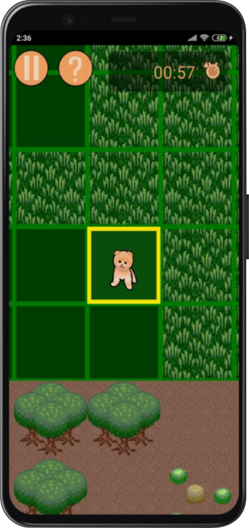
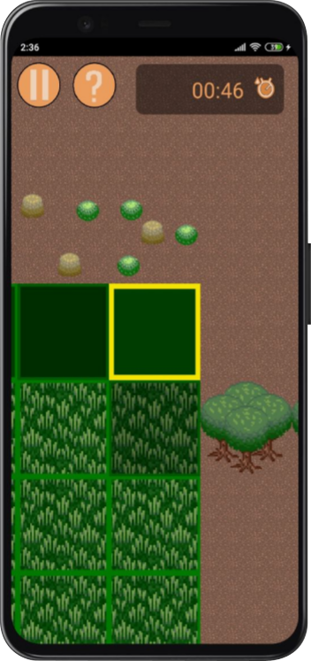
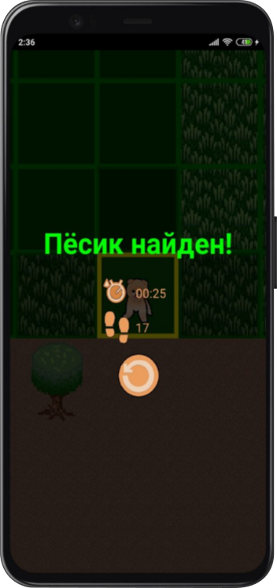

## FindPuppy: A Game of Survival and Cuteness 🐶

<body>
  

    
    
    
  

</body>

🕷️ Imagine being stranded in a desolate field, where the wind whispers secrets in your ear and the shadows writhe like living things...

The voices are closing in, their whispers growing louder, and you're not sure what's lurking just out of sight...

BUT THEN, you hear it - a faint, mournful whimpering in the distance, like the cry of a lost soul...

Your heart skips a beat as you realize you're not alone...

There's a puppy out ther... and it's calling to you...

**Find Puppy** 🐶 is a haunting Android game that will test your courage and challenge your perceptions. So, take a deep breath, steel yourself, and venture into the unknown. 

The puppy is waiting... but for how long?

---

### Find Puppy 🐶

FindPuppy is a 2D Android game built using Kotlin and Jetpack Compose. The game takes place in a grid-based field, where the player must navigate to find a puppy while avoiding unknown dangers.

**Gameplay Mechanics:**

* The player starts in the center of the field and can move in four directions (up, down, left, right).
* The game generates a random puppy location and unknown dangers (enemies) in the field.
* The player receives audio cues (whispers) and vibration indicating the direction of the puppy and enemies.
* The player must use their wits to navigate the field, avoiding enemies and finding the puppy before it's too late.

**Technical Features:**

* Built using Kotlin and Jetpack Compose for a Android devices.
* Grid-based 16x16 field generation.
* Audio cues, sound effects and vibration for an immersive experience.
* Simple yet challenging gameplay mechanics for a fun and engaging experience.

---

### The Samsung IT School

I'm excited to share that I've completed the **Samsung IT School** program, graduating on <u>*June 2023*</u>! 

As part of the program, I developed a this game, which I presented to the class using [this presentation](files/find-puppy-presentation.pdf).

I'm proud to say that I not only completed the program, but I also received a Graduation Diploma for my hard work and dedication (just look at this):

  
  

It was an incredible experience, and I'm grateful for the opportunity to have learned from such institution.
